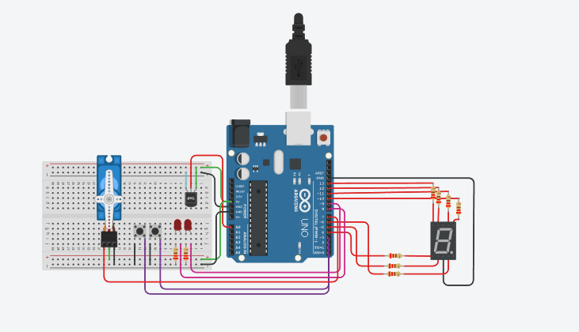
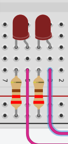
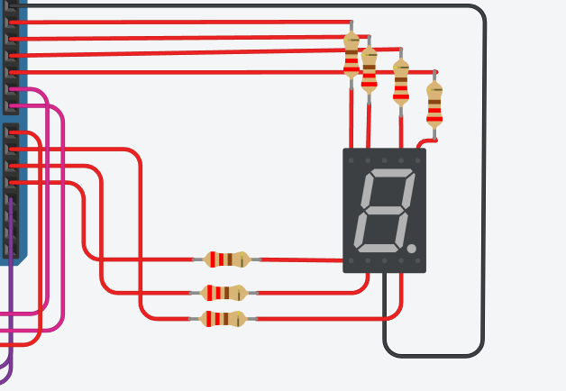
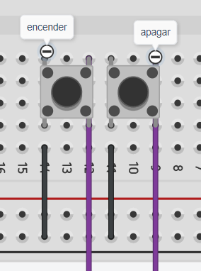
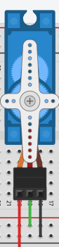
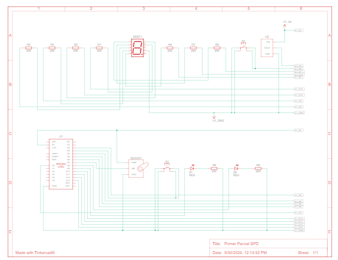

# Parcial 1 Sistema de Procesamiento de Datos

## Alumno y division

* Lautaro Guidara
* A211


## Proyecto: Sistema de incendios



## Descripcion

El proyecto conecta 2 botones, un display de 7 segmentos en el que se mostrar el nivel de temperatura, dos leds para simular una señal de emergencia y un servo motor que actuaria como válvula de agua al momento de crearse un incendio.

## Componentes

### 2 leds rojos: 

Los leds son luces que pueden ser de distintos colores. Al catodo de los leds se los conecta a una resistencia y al GND, al anodo se lo conecta en el pin al que se asignará. 
En el código, los leds representarán una señal de alarma que, al llegar a los 60 grados Celsius (Nivel 7 de temperatura), se prenderan para simular una señal.
A cada led se le conecta una resistencia de 220 ohms en el cátodo.



### Display de siete segmentos:  

Un display o visualizador de 7 segmentos es un dispositivo que consta de 7 luces leds (en realidad 8) que nos permiten formar numeros del 0 al 9. Cada led tiene asignada una letra (De la A hasta la G) las cuales deben ser relacionadas a un pin para que funcionen. Además de conectarlo al GND y determinar si será de cátodo común o ánodo común.
En el código, el visualizador representará el nivel de temperatura que detecte el sistema de incendios.
Se conecta un cable en cada segmento del display junto a una resistencia de 220 ohms cada una, además de conectarse al GND y se lo asigna como Cátodo común.




### Botones: 
Un pulsador o botón está conformado por dos pares de patillas(1a/1b y 2a/2b) que no se conectan entre ellas. En el código podremos leer el estado de este pulsador y utilizarlo. Para usarlos se debe implementar una resistencia pull up de Arduino.
En el código representarán los botones de encendido y apagado.
Cada botón estará conectado al GND en 1a y a su respectivo pin en 2b.



## Servo motor:
El servomotor nos permite controlar la posicion angular de un eje. Este podrá moverse en un rango de 180 grados.
Tambien se debe implementar una libreria llamada "Servo.h"
Se utilizan tres cables, uno para el GND, otro para el 5V y el último para el pin correspondiente al arduino.

En el código se utiliza para simular una respuesta en caso de encenderse la alarma.





## Código

### Asignación de pines e inicializacion de variables

Antes de empezar el código, se definen los pines, en este caso los leds son 9 y 8, Los segmentos del display van de 13 a 10 y de 6 hasta 4, el sensor de tempatura va al A0, los botones son 3 y 2, y por ultimo agrego la biblioteca del servo motor:

```C++
#include <Servo.h>
#define BotonOFF 3
#define BotonON 2
#define G 13	
#define F 12
#define A 11
#define B 10
#define C 6
#define D 5
#define E 4
#define LED_ROJO 9
#define LED_ROJO2 8
```

Tambien se inicializan algunas variables para despúes:

```C++
Servo palanca;
bool ENCENDIDO = true;
```

### Declaracion de pines

Una vez conectado los elementos y definidos los pines se declara cual va a ser su funcion. Tanto los leds como el display de siete segmentos se definen como elementos de salida. Los botones se definen como entradas digitales, también se los declara como "PULLUP" para ahorranos utilizar una resistencia. Por último se inicia un Serial, y se asocia el servo al pin 7:

```C++
void setup()
{
  Serial.begin(9600);
  pinMode(BotonOFF, INPUT_PULLUP);
  pinMode(BotonON, INPUT_PULLUP);
  pinMode(G, OUTPUT);
  pinMode(F, OUTPUT);
  pinMode(A, OUTPUT);
  pinMode(B, OUTPUT);
  pinMode(C, OUTPUT);
  pinMode(D, OUTPUT);
  pinMode(E, OUTPUT);
  pinMode(LED_ROJO, OUTPUT);
  pinMode(LED_ROJO2, OUTPUT);
  palanca.attach(7);
}

```


### Funciones del loop 
```C++
void loop()
{ 
  int contadorTemperatura;
  int lecturaTemperatura = analogRead(A0);
  contadorTemperatura = map(lecturaTemperatura, 20, 358, -40, 125); //CELSIUS
  // Funcionalidad de los botones
  if (digitalRead(BotonOFF) == 0) 
  {
        ENCENDIDO = false;
  }
  if (digitalRead(BotonON)== 0) 
  {
        ENCENDIDO = true;
  }
  if (ENCENDIDO == true) // Mientras el sistema este encendido:
  {
    Serial.println(contadorTemperatura);
    if (contadorTemperatura < 30)
    {
      mostrarNumero(0);
      PrenderApagar(false);
    }    
    else if (contadorTemperatura >= 30 && contadorTemperatura <= 34)
    {
      mostrarNumero(1);
      PrenderApagar(false);
    }
    else if (contadorTemperatura >= 35 && contadorTemperatura <= 39)
    {
      mostrarNumero(2);
      PrenderApagar(false);
    }
    else if (contadorTemperatura >= 40 && contadorTemperatura <= 44)
    {
      mostrarNumero(3);
      PrenderApagar(false);
    }
    else if (contadorTemperatura >= 45 && contadorTemperatura <= 49)
    {
      mostrarNumero(4);
      PrenderApagar(false);
    }
    else if (contadorTemperatura >= 50 && contadorTemperatura <= 54)
    {
      mostrarNumero(5);
      PrenderApagar(false);
    }
    else if (contadorTemperatura >= 55 && contadorTemperatura <= 60)
    {
      mostrarNumero(6);
      PrenderApagar(false);
    }
    else if (contadorTemperatura >= 60 && contadorTemperatura <= 64)
    {
      mostrarNumero(7);
      PrenderApagar(true);
    }
    else if (contadorTemperatura >= 65 && contadorTemperatura <= 70)
    {
      mostrarNumero(8);
      PrenderApagar(true);
    }
    else
    {
      mostrarNumero(9);
      PrenderApagar(true);
    }
  }
  else //Cuando el sistema este apagado
  {
    mostrarNumero(-1);
  }
}
```
Primero se mapeara el sensor de temperatura para asignarle un nuevo min-max de -40 a 125, de manera que pasaria de grados Fahrenheit (predeterminado de este) a Celsius (Nuevo). 

Luego se le da una utilidad a los botones. El BotonOFF igualara la variable "ENCENDIDO" a 0, deteniendo los procesos, y el BotonON lo igualaria a 1. Mientras que "ENCENDIDO" se igual a 1. Se iniciara el sistema de incendios. El sensor de temperatura printea constantemente la temperatura actual, mientras que al llamar las funciones "mostrarNumero" y "PrenderApagar" se activarian los numeros del display que mostrarian el nivel de temperatura actual. Mientras que se verifica si es necesario encender la alarma de LEDs y la válvula agua.

Cuando el sistema se apague, no se mostrara ningun numero en el display.


#### "mostrarNumero":

La funcion se encarga mostrar el nivel de temperatura en el display de 7 segmentos:

```C++
void mostrarNumero(int display)
{
   switch(display)
   {
    case 0:
     digitalWrite(A, 1);
  	 digitalWrite(B, 1);
  	 digitalWrite(C, 1);
  	 digitalWrite(D, 1);
  	 digitalWrite(E, 1);
  	 digitalWrite(F, 1);
     digitalWrite(G, 0);
     break;
	 
     case 1:

     digitalWrite(A, 0);
  	 digitalWrite(B, 1);
  	 digitalWrite(C, 1);
  	 digitalWrite(D, 0);
  	 digitalWrite(E, 0);
   	 digitalWrite(F, 0);
     digitalWrite(G, 0);
     
     break;

     case 2:
     digitalWrite(A, 1);
  	 digitalWrite(B, 1);
  	 digitalWrite(C, 0);
  	 digitalWrite(D, 1);
  	 digitalWrite(E, 1);
   	 digitalWrite(F, 0);
     digitalWrite(G, 1);
     break;

     case 3:
     digitalWrite(A, 1);
  	 digitalWrite(B, 1);
  	 digitalWrite(C, 1);
  	 digitalWrite(D, 1);
  	 digitalWrite(E, 0);
   	 digitalWrite(F, 0);
     digitalWrite(G, 1);
     
     break;
  
     case 4:
     digitalWrite(A, 0);
  	 digitalWrite(B, 1);
  	 digitalWrite(C, 1);
  	 digitalWrite(D, 0);
  	 digitalWrite(E, 0);
   	 digitalWrite(F, 1);
     digitalWrite(G, 1);
     break;

	 case 5:
     digitalWrite(A, 1);
  	 digitalWrite(B, 0);
  	 digitalWrite(C, 1);
  	 digitalWrite(D, 1);
  	 digitalWrite(E, 0);
   	 digitalWrite(F, 1);
     digitalWrite(G, 1);
     break;
  
	 case 6:
     digitalWrite(A, 1);
     digitalWrite(B, 0);
     digitalWrite(C, 1);
     digitalWrite(D, 1);
     digitalWrite(E, 1);
     digitalWrite(F, 1);
     digitalWrite(G, 1);
     break;
  
	 case 7:
     digitalWrite(A, 1);
  	 digitalWrite(B, 1);
  	 digitalWrite(C, 1);
  	 digitalWrite(D, 0);
  	 digitalWrite(E, 0);
   	 digitalWrite(F, 0);
     digitalWrite(G, 0);
     break;
  
	 case 8:
     digitalWrite(A, 1);
     digitalWrite(B, 1);
     digitalWrite(C, 1);
     digitalWrite(D, 1);
     digitalWrite(E, 1);
     digitalWrite(F, 1);
     digitalWrite(G, 1);
     break;

     case 9:
     digitalWrite(A, 1);
     digitalWrite(B, 1);
     digitalWrite(C, 1);
     digitalWrite(D, 0);
     digitalWrite(E, 0);
     digitalWrite(F, 1);
     digitalWrite(G, 1);
     break;
     
     case -1:
     digitalWrite(A, 0);
     digitalWrite(B, 0);
     digitalWrite(C, 0);
     digitalWrite(D, 0);
     digitalWrite(E, 0);
     digitalWrite(F, 0);
     digitalWrite(G, 0);
     break;
   }
}
```
La funcion recibe el numero del contador y lo verifica con un switch, el cual mostrara en el display, el numero asociado en cada case. El caso -1 se ocupa de apagar todos los segmentos.

#### "PrenderApagar":

Se encarga de Prender y apagar los leds en caso de un incendio:
```C++
void PrenderApagar(Bool estado)
{
  if (estado == true)
  {
    digitalWrite(LED_ROJO, 1);
	digitalWrite(LED_ROJO2, 1);
    valvula(true);
  }	
  else
  {
    digitalWrite(LED_ROJO, 0);
    digitalWrite(LED_ROJO2, 0);
    valvula(false);
  }
}
```
La funncion simplemente prende los leds rojos para simular una emergencia cuando se lo llame con el parametro del booleano "estado" en true, no activandose en el caso de que este mismo sea falso. A la vez, se llama a la funcion "valvula" para que se active en caso de un incendio.

#### "valvula":

La funcion se encarga de encender la válvula en caso de incendio:

```C++
void valvula(bool agua)
{
  if (agua == true)
  {
    palanca.write(90);
    Serial.print("VALVULA DE AGUA ACTIVADA | ");
  }
  else
  {
    palanca.write(0);
  }
}
```
En caso en el cual se ocasiona un incendio (Pasados los 60 grados Celsius), la válvula de agua se activaria y rotaria 90 grados. Simulando la activacion de esta.

## Link al proyecto

[tinkercard.com](https://www.tinkercad.com/things/fZnOQnZzAmt-primer-parcial-spd-?sharecode=mCB4f_MJFonFUdPVZiZEpwiwRK8U6kubc270jhV-QnY)

## Consigna

[classroom.com](https://docs.google.com/document/d/1OXghRyK0ikSok0B5mutCf208xmn3gga__RpT2ktDy6U/edit)

## Codigo Fuente

[onlinegdb.com](https://onlinegdb.com/v_PY7E81w)

## Diagrama esquemático

